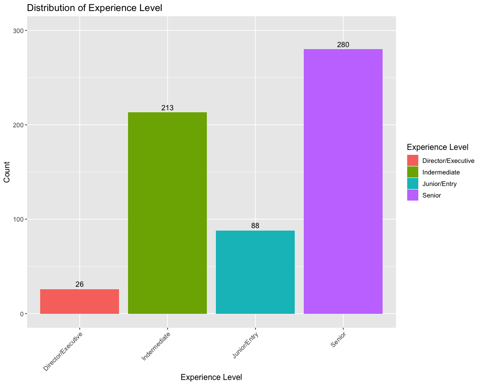
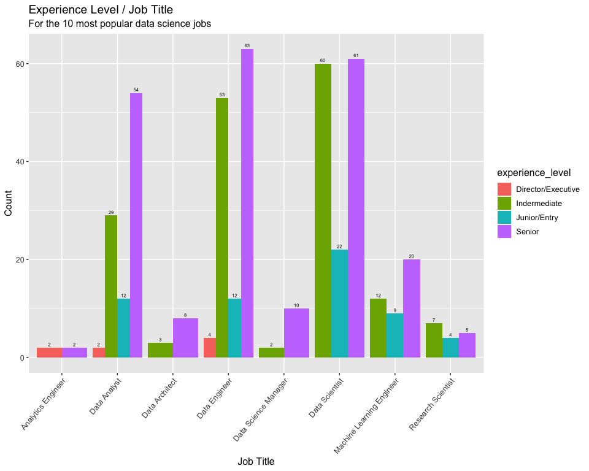
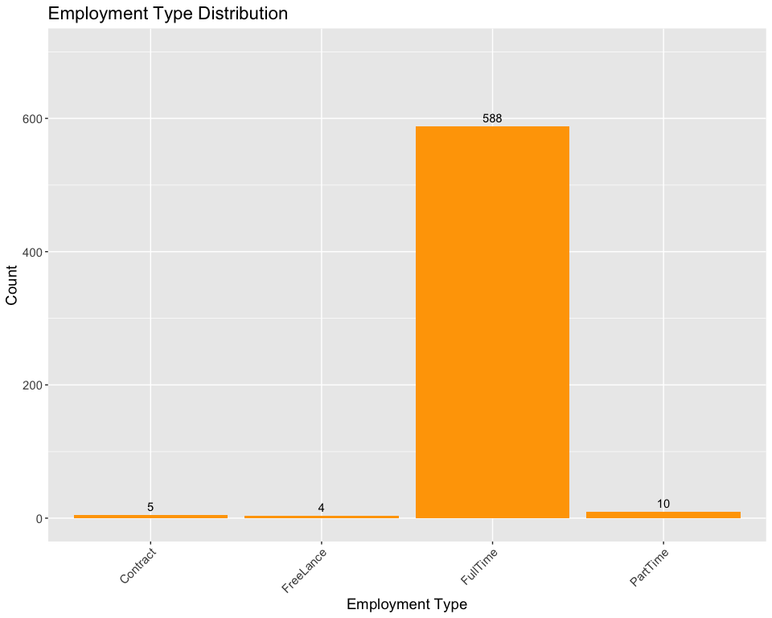
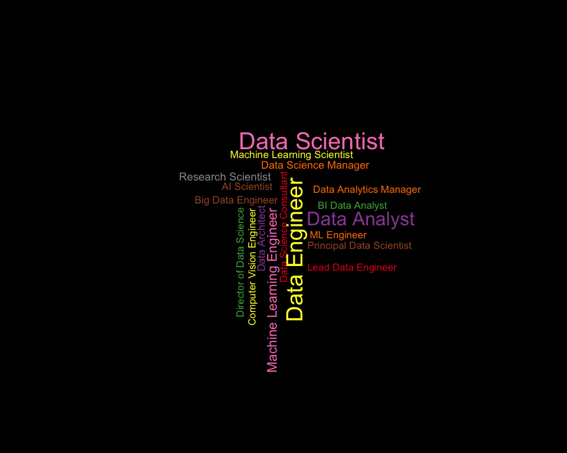
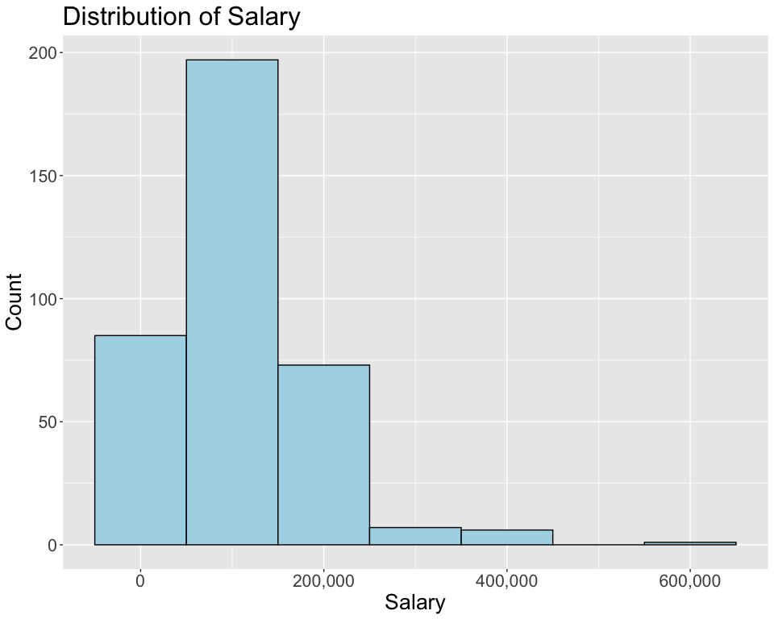
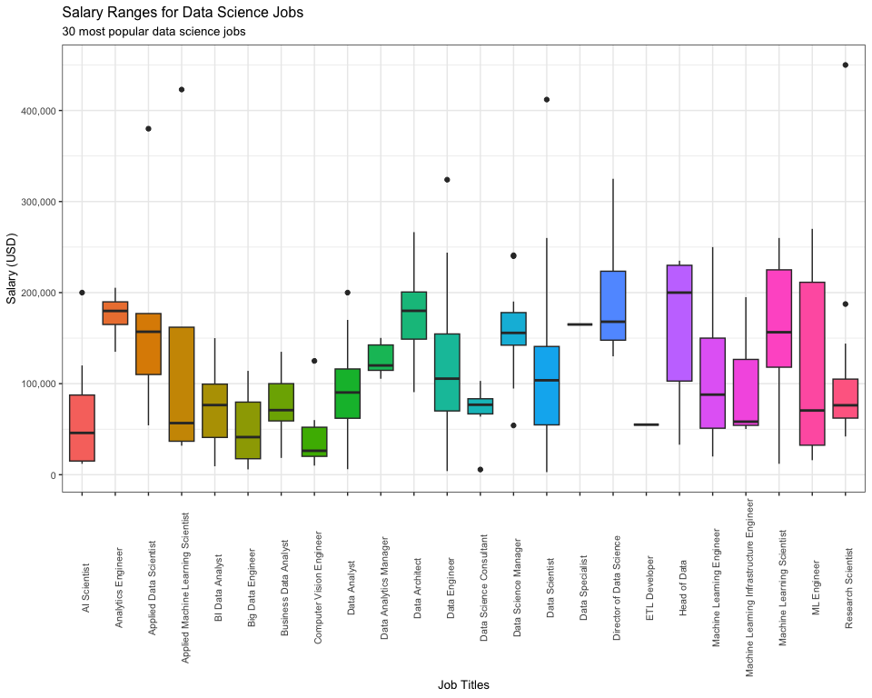
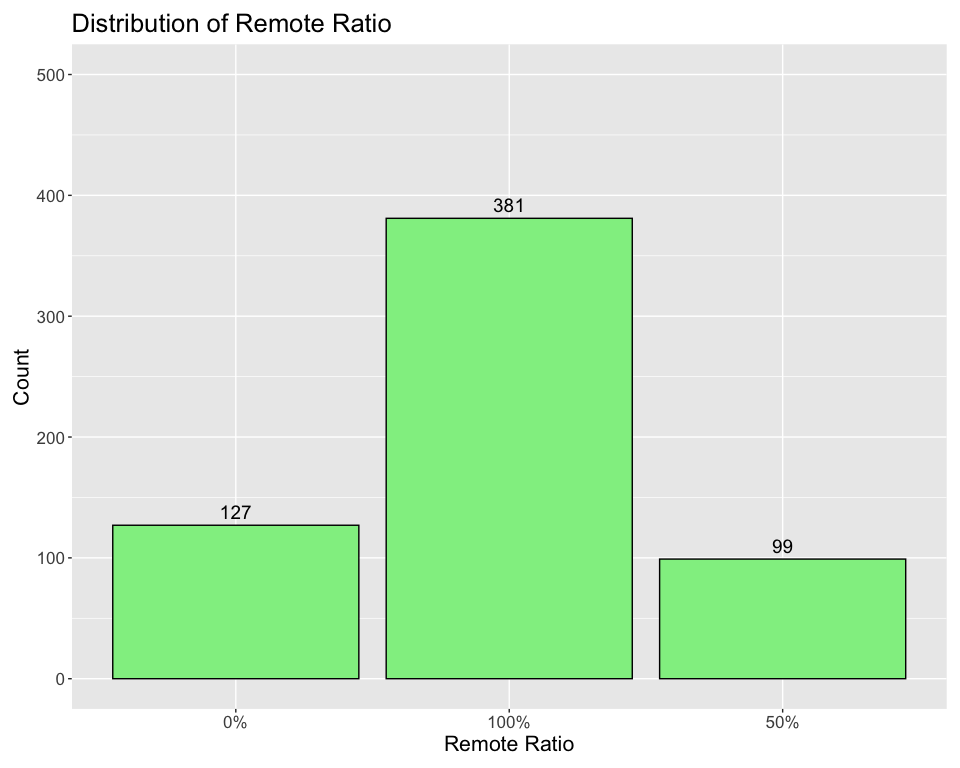
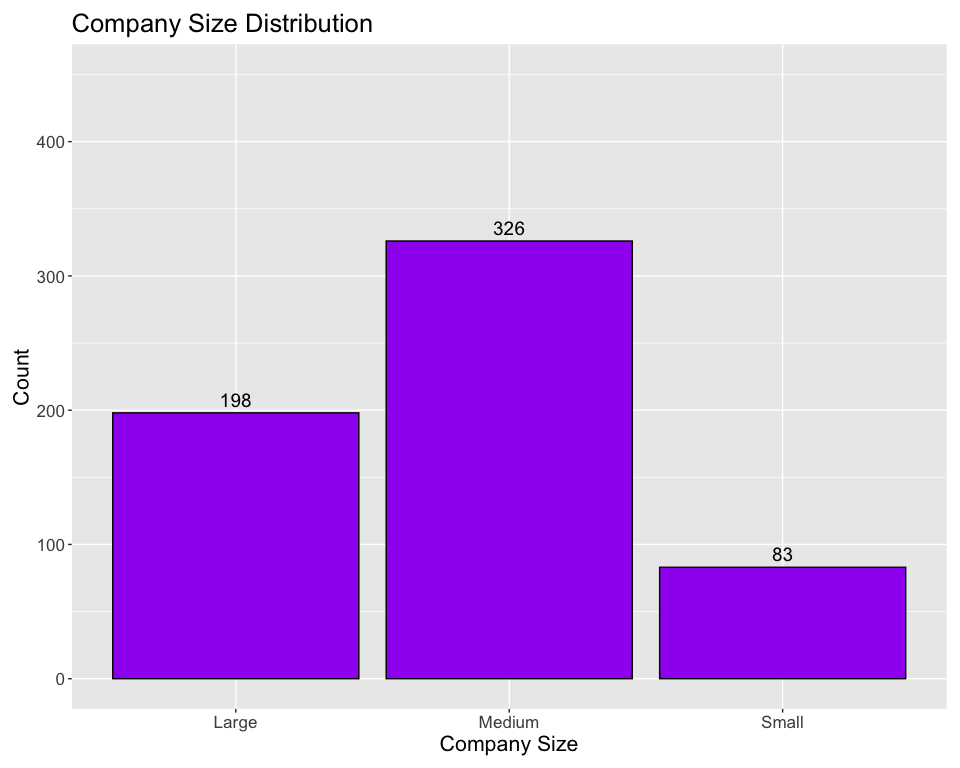

# Project Overview:

The CEO of the small, but rapidly expanding company I work for is interested in hiring a full-time data scientist.
While the company is located in the US, the position can be remote for the right person.
My research will include salary differences between hiring someone in the US vs. someone outside of the US.
I will analyze data to find the salary distribution of employee residence, job title, and experience level, among other factors in order to determine a reasonable salary range that will allow us to hire the best talent.
Factors to consider include rising salaries in the recession, along with a highly competitive job market.


```r
options(repos = "https://cran.rstudio.com/")
```


```r
    install.packages("tidyverse")
```

```
## 
## The downloaded binary packages are in
## 	/var/folders/7w/vf_3wx5d6kq9bm2666hl7yy80000gn/T//RtmpJH2Hox/downloaded_packages
```

```r
    install.packages("ggwordcloud")
```

```
## 
## The downloaded binary packages are in
## 	/var/folders/7w/vf_3wx5d6kq9bm2666hl7yy80000gn/T//RtmpJH2Hox/downloaded_packages
```

```r
    install.packages("viridis")
```

```
## 
## The downloaded binary packages are in
## 	/var/folders/7w/vf_3wx5d6kq9bm2666hl7yy80000gn/T//RtmpJH2Hox/downloaded_packages
```

```r
    install.packages("scales")
```

```
## 
## The downloaded binary packages are in
## 	/var/folders/7w/vf_3wx5d6kq9bm2666hl7yy80000gn/T//RtmpJH2Hox/downloaded_packages
```

```r
    install.packages("dplyr")
```

```
## 
## The downloaded binary packages are in
## 	/var/folders/7w/vf_3wx5d6kq9bm2666hl7yy80000gn/T//RtmpJH2Hox/downloaded_packages
```

```r
    library(tidyverse)
```

```
## ── Attaching core tidyverse packages ──────────────────────── tidyverse 2.0.0 ──
## ✔ dplyr     1.1.2     ✔ readr     2.1.4
## ✔ forcats   1.0.0     ✔ stringr   1.5.0
## ✔ ggplot2   3.4.2     ✔ tibble    3.2.1
## ✔ lubridate 1.9.2     ✔ tidyr     1.3.0
## ✔ purrr     1.0.1     
## ── Conflicts ────────────────────────────────────────── tidyverse_conflicts() ──
## ✖ dplyr::filter() masks stats::filter()
## ✖ dplyr::lag()    masks stats::lag()
## ℹ Use the conflicted package (<http://conflicted.r-lib.org/>) to force all conflicts to become errors
```

```r
    library(ggwordcloud)
    library(viridis)
```

```
## Loading required package: viridisLite
```

```r
    library(scales)
```

```
## 
## Attaching package: 'scales'
## 
## The following object is masked from 'package:viridis':
## 
##     viridis_pal
## 
## The following object is masked from 'package:purrr':
## 
##     discard
## 
## The following object is masked from 'package:readr':
## 
##     col_factor
```

```r
    library(dplyr)

    options(repr.plot.width = 15, repr.plot.height = 15)
```


```r
#Main Data set
salary_df <- read.csv("data.csv")

#Country codes Data set, used for cleaning later
iso_df <- read.csv("wikipedia-iso-country-codes.csv")
```

Checking the dimensions of a dataframe can be useful for understanding the size and structure of your data and for performing various operations and analyses based on the number of rows and columns present.


```r
t(t(names(salary_df))) # In summary, the code transposes the column names of the data_df dataframe and returns them as a column matrix to display the column names in a user friendly manner.
```

```
##       [,1]                
##  [1,] "X"                 
##  [2,] "work_year"         
##  [3,] "experience_level"  
##  [4,] "employment_type"   
##  [5,] "job_title"         
##  [6,] "salary"            
##  [7,] "salary_currency"   
##  [8,] "salary_in_usd"     
##  [9,] "employee_residence"
## [10,] "remote_ratio"      
## [11,] "company_location"  
## [12,] "company_size"
```

```r
#Dimensions of the data frame
data_dimensions <- dim(salary_df)
num_rows <- data_dimensions[1]
num_cols <- data_dimensions[2]

text <- paste("There are", num_rows,"Rows", "and", num_cols, "Columns", "in this dataset")

print(text)
```

```
## [1] "There are 607 Rows and 12 Columns in this dataset"
```


```r
head(salary_df)  #Displays the first couple of rows of the data frame
```

```
##   X work_year experience_level employment_type                  job_title
## 1 0      2020               MI              FT             Data Scientist
## 2 1      2020               SE              FT Machine Learning Scientist
## 3 2      2020               SE              FT          Big Data Engineer
## 4 3      2020               MI              FT       Product Data Analyst
## 5 4      2020               SE              FT  Machine Learning Engineer
## 6 5      2020               EN              FT               Data Analyst
##   salary salary_currency salary_in_usd employee_residence remote_ratio
## 1  70000             EUR         79833                 DE            0
## 2 260000             USD        260000                 JP            0
## 3  85000             GBP        109024                 GB           50
## 4  20000             USD         20000                 HN            0
## 5 150000             USD        150000                 US           50
## 6  72000             USD         72000                 US          100
##   company_location company_size
## 1               DE            L
## 2               JP            S
## 3               GB            M
## 4               HN            S
## 5               US            L
## 6               US            L
```


```r
str(salary_df)  #Display list of columns and data types
```

```
## 'data.frame':	607 obs. of  12 variables:
##  $ X                 : int  0 1 2 3 4 5 6 7 8 9 ...
##  $ work_year         : int  2020 2020 2020 2020 2020 2020 2020 2020 2020 2020 ...
##  $ experience_level  : chr  "MI" "SE" "SE" "MI" ...
##  $ employment_type   : chr  "FT" "FT" "FT" "FT" ...
##  $ job_title         : chr  "Data Scientist" "Machine Learning Scientist" "Big Data Engineer" "Product Data Analyst" ...
##  $ salary            : int  70000 260000 85000 20000 150000 72000 190000 11000000 135000 125000 ...
##  $ salary_currency   : chr  "EUR" "USD" "GBP" "USD" ...
##  $ salary_in_usd     : int  79833 260000 109024 20000 150000 72000 190000 35735 135000 125000 ...
##  $ employee_residence: chr  "DE" "JP" "GB" "HN" ...
##  $ remote_ratio      : int  0 0 50 0 50 100 100 50 100 50 ...
##  $ company_location  : chr  "DE" "JP" "GB" "HN" ...
##  $ company_size      : chr  "L" "S" "M" "S" ...
```


```r
summary(salary_df)  #Statistical summary of data 
```

```
##        X           work_year    experience_level   employment_type   
##  Min.   :  0.0   Min.   :2020   Length:607         Length:607        
##  1st Qu.:151.5   1st Qu.:2021   Class :character   Class :character  
##  Median :303.0   Median :2022   Mode  :character   Mode  :character  
##  Mean   :303.0   Mean   :2021                                        
##  3rd Qu.:454.5   3rd Qu.:2022                                        
##  Max.   :606.0   Max.   :2022                                        
##   job_title             salary         salary_currency    salary_in_usd   
##  Length:607         Min.   :    4000   Length:607         Min.   :  2859  
##  Class :character   1st Qu.:   70000   Class :character   1st Qu.: 62726  
##  Mode  :character   Median :  115000   Mode  :character   Median :101570  
##                     Mean   :  324000                      Mean   :112298  
##                     3rd Qu.:  165000                      3rd Qu.:150000  
##                     Max.   :30400000                      Max.   :600000  
##  employee_residence  remote_ratio    company_location   company_size      
##  Length:607         Min.   :  0.00   Length:607         Length:607        
##  Class :character   1st Qu.: 50.00   Class :character   Class :character  
##  Mode  :character   Median :100.00   Mode  :character   Mode  :character  
##                     Mean   : 70.92                                        
##                     3rd Qu.:100.00                                        
##                     Max.   :100.00
```


```r
# Checking for any NA values
any(is.na(salary_df))
```

```
## [1] FALSE
```

```r
#Checking for unique values per column
library(dplyr)
salary_df %>% 
  summarise(
    work_year = n_distinct(work_year),
    experience_level = n_distinct(experience_level),
    employment_type = n_distinct(employment_type),
    job_title = n_distinct(job_title),
    salary = n_distinct(salary),
    salary_currency = n_distinct(salary_currency),
    salary_in_usd = n_distinct(salary_in_usd),
    employee_residence = n_distinct(employee_residence),
    remote_ratio = n_distinct(remote_ratio),
    company_location = n_distinct(company_location),
    company_size = n_distinct(company_size)
  )
```

```
##   work_year experience_level employment_type job_title salary salary_currency
## 1         3                4               4        50    272              17
##   salary_in_usd employee_residence remote_ratio company_location company_size
## 1           369                 57            3               50            3
```

Cleaning the Data
There are a few problems we need to fix:
1. The columns experience_level, employment_type, employee_residence, company_size and company_location contain abbreviations that may not be understood to some, we will rename the data contained in those columns to more descriptive labels.¶


```r
#Renamed abbreviations for the experience_level column
salary_df$experience_level[salary_df$experience_level == "SE"] <- "Senior"
salary_df$experience_level[salary_df$experience_level == "MI"] <- "Indermediate"
salary_df$experience_level[salary_df$experience_level == "EN"] <- "Junior/Entry"
salary_df$experience_level[salary_df$experience_level == "EX"] <- "Director/Executive"

#Renamed abbreviations for the employment_type column
salary_df$employment_type[salary_df$employment_type == "FT"] <- "FullTime"
salary_df$employment_type[salary_df$employment_type == "PT"] <- "PartTime"
salary_df$employment_type[salary_df$employment_type == "CT"] <- "Contract"
salary_df$employment_type[salary_df$employment_type == "FL"] <- "FreeLance"

#Renamed abbreviations for the company_size column
salary_df$company_size[salary_df$company_size == "S"] <- "Small"
salary_df$company_size[salary_df$company_size == "M"] <- "Medium"
salary_df$company_size[salary_df$company_size == "L"] <- "Large"

#Pulling columns from salary_df and iso into vectors that we can iterate from.
employee_residence <- salary_df %>% pull(employee_residence)

Alpha.2.code <- iso_df %>% pull(Alpha.2.code)

Country_name <- iso_df %>% pull(English.short.name.lower.case)

index <- 0
new_employee_residence <- c()

#Looping through each item in new_employee_residence
for (item in employee_residence) {
  
#check where the item exists in Alpha.2.code, then assign the index found in Alpha.2.code to index
    index <- which(Alpha.2.code == item)[1]
    
#use the index to find the corresponding Country_name, then append that Country_name to new_employee_residence, save to new_employee_residence
    new_employee_residence <- append(new_employee_residence, Country_name[index])
}

# assign new_employee_residence to the employee_residence column
salary_df$employee_residence <- new_employee_residence
```


```r
str(salary_df$experience_level)
```

```
##  chr [1:607] "Indermediate" "Senior" "Senior" "Indermediate" "Senior" ...
```

```r
str(salary_df$employment_type)
```

```
##  chr [1:607] "FullTime" "FullTime" "FullTime" "FullTime" "FullTime" ...
```

```r
str(salary_df$employee_residence)
```

```
##  chr [1:607] "Germany" "Japan" "United Kingdom" "Honduras" ...
```

```r
str(salary_df$company_size)
```

```
##  chr [1:607] "Large" "Small" "Medium" "Small" "Large" "Large" "Small" ...
```

```r
str(salary_df$company_location)
```

```
##  chr [1:607] "DE" "JP" "GB" "HN" "US" "US" "US" "HU" "US" "NZ" "FR" "IN" ...
```

2. We do not need the salary or salary_currency columns for our analysis.¶

```r
salary_df <- salary_df %>%
  select(-c(X, salary, salary_currency))

str(salary_df)
```

```
## 'data.frame':	607 obs. of  9 variables:
##  $ work_year         : int  2020 2020 2020 2020 2020 2020 2020 2020 2020 2020 ...
##  $ experience_level  : chr  "Indermediate" "Senior" "Senior" "Indermediate" ...
##  $ employment_type   : chr  "FullTime" "FullTime" "FullTime" "FullTime" ...
##  $ job_title         : chr  "Data Scientist" "Machine Learning Scientist" "Big Data Engineer" "Product Data Analyst" ...
##  $ salary_in_usd     : int  79833 260000 109024 20000 150000 72000 190000 35735 135000 125000 ...
##  $ employee_residence: chr  "Germany" "Japan" "United Kingdom" "Honduras" ...
##  $ remote_ratio      : int  0 0 50 0 50 100 100 50 100 50 ...
##  $ company_location  : chr  "DE" "JP" "GB" "HN" ...
##  $ company_size      : chr  "Large" "Small" "Medium" "Small" ...
```

3. Since remote_ratio contains ratios they all should have % at the end.¶


```r
salary_df$remote_ratio <- gsub("%", "", salary_df$remote_ratio)
```


```r
#Add a % at the end of every element in remote_ratio
remote_ratio <- salary_df %>% pull(remote_ratio)
new_remote_ratio <- paste0(remote_ratio, "%")

salary_df$remote_ratio <- new_remote_ratio
```


```r
str(salary_df$remote_ratio)
```

```
##  chr [1:607] "0%" "0%" "50%" "0%" "50%" "100%" "100%" "50%" "100%" "50%" ...
```

Analysis


```r
library(ggplot2)
library(dplyr)

experience_level <- data.frame(experience_level = salary_df$experience_level)
experience_counts <- experience_level %>% count(experience_level)

ggplot(data = experience_level) +
  geom_bar(mapping = aes(x = experience_level, fill = experience_level)) +
  geom_text(data = experience_counts, aes(x = experience_level, y = n, label = n), vjust = -0.5) +
  theme(axis.text.x = element_text(angle = 45, hjust = 1), text = element_text(size = 12)) +
  labs(title = "Distribution of Experience Level",
       x = "Experience Level",
       y = "Count",
       fill = "Experience Level") +
  coord_cartesian(ylim = c(0, 300))
```

<!-- -->
Most people with data science related jobs are Senior level.


```r
library(ggplot2)

query <- salary_df %>%
  select(job_title, experience_level) %>%
  group_by(job_title, experience_level) %>%
  summarise(Count = n()) %>%
  arrange(desc(Count)) %>%
  filter(job_title %in% c("Data Engineer", "Data Scientist", "Data Analyst", "Machine Learning Engineer", "Analytics Engineer", "Data Architect", "Research Scientist", "Applied Scientist", "Data Science Manager", "Research Engineer"))
```

```
## `summarise()` has grouped output by 'job_title'. You can override using the
## `.groups` argument.
```

```r
ggplot(query, aes(x = job_title, y = Count, fill = experience_level)) +
  geom_bar(stat = "identity", position = "dodge") +
  geom_text(aes(label = Count, group = experience_level), position = position_dodge(width = 0.9), vjust = -0.5, size = 2, color = "black") +
  theme(axis.text.x = element_text(angle = 50, hjust = 1), text = element_text(size = 12)) +
  labs(title = "Experience Level / Job Title", subtitle = "For the 10 most popular data science jobs", x = "Job Title")
```

<!-- -->
The ratio of Seniors vs other experience levels is roughly the same per job title.


```r
library(ggplot2)

employment_type <- data.frame(employment_type = salary_df$employment_type)

ggplot(data = employment_type, aes(x = employment_type)) +
  geom_bar(fill = "orange") +
  geom_text(stat = "count", aes(label = after_stat(count)), vjust = -0.5, color = "black") +
  labs(title = "Employment Type Distribution", x = "Employment Type", y = "Count") +
  theme(axis.text.x = element_text(angle = 45, hjust = 1), text = element_text(size = 14)) + 
  scale_y_continuous(limits = c(0, 700))
```

<!-- -->
Virtually all employees are full time.


```r
job_title_counts <- table(salary_df$job_title)

# Order the job titles in decreasing order
ordered_counts <- sort(job_title_counts, decreasing = TRUE)

# Display the ordered job title counts
ordered_counts
```

```
## 
##                           Data Scientist 
##                                      143 
##                            Data Engineer 
##                                      132 
##                             Data Analyst 
##                                       97 
##                Machine Learning Engineer 
##                                       41 
##                       Research Scientist 
##                                       16 
##                     Data Science Manager 
##                                       12 
##                           Data Architect 
##                                       11 
##                        Big Data Engineer 
##                                        8 
##               Machine Learning Scientist 
##                                        8 
##                             AI Scientist 
##                                        7 
##                   Data Analytics Manager 
##                                        7 
##                  Data Science Consultant 
##                                        7 
##                 Director of Data Science 
##                                        7 
##                 Principal Data Scientist 
##                                        7 
##                          BI Data Analyst 
##                                        6 
##                 Computer Vision Engineer 
##                                        6 
##                       Lead Data Engineer 
##                                        6 
##                              ML Engineer 
##                                        6 
##                   Applied Data Scientist 
##                                        5 
##                    Business Data Analyst 
##                                        5 
##                 Data Engineering Manager 
##                                        5 
##                             Head of Data 
##                                        5 
##                       Analytics Engineer 
##                                        4 
##       Applied Machine Learning Scientist 
##                                        4 
##                  Data Analytics Engineer 
##                                        4 
##                     Head of Data Science 
##                                        4 
##        Computer Vision Software Engineer 
##                                        3 
##                    Data Science Engineer 
##                                        3 
##                        Lead Data Analyst 
##                                        3 
##                      Lead Data Scientist 
##                                        3 
##               Machine Learning Developer 
##                                        3 
## Machine Learning Infrastructure Engineer 
##                                        3 
##                  Principal Data Engineer 
##                                        3 
##                      Cloud Data Engineer 
##                                        2 
##             Director of Data Engineering 
##                                        2 
##                            ETL Developer 
##                                        2 
##                   Financial Data Analyst 
##                                        2 
##                   Principal Data Analyst 
##                                        2 
##                     Product Data Analyst 
##                                        2 
##            3D Computer Vision Researcher 
##                                        1 
##                       Big Data Architect 
##                                        1 
##                      Data Analytics Lead 
##                                        1 
##                          Data Specialist 
##                                        1 
##                     Finance Data Analyst 
##                                        1 
##                 Head of Machine Learning 
##                                        1 
##           Lead Machine Learning Engineer 
##                                        1 
##                 Machine Learning Manager 
##                                        1 
##                   Marketing Data Analyst 
##                                        1 
##                             NLP Engineer 
##                                        1 
##                     Staff Data Scientist 
##                                        1
```


```r
library(wordcloud)
```

```
## Loading required package: RColorBrewer
```

```r
library(RColorBrewer)

# Convert job_title to character
salary_df$job_title <- as.character(salary_df$job_title)

# Filter the data based on job titles with count > 5
filtered_counts <- job_title_counts[job_title_counts > 5]

# Generate 20 bright colors by repeating the "Set1" palette
num_colors <- 20
colors <- rep(brewer.pal(9, "Set1"), length.out = num_colors)

# Create a data frame with word frequencies
word_data <- data.frame(word = names(filtered_counts),
                        freq = as.numeric(filtered_counts))

# Set a dark background for the word cloud
par(bg = "black")

# Generate the word cloud using wordcloud
set.seed(123)  # For reproducibility of colors and angles
wordcloud(word_data$word, word_data$freq, scale = c(2.5, 1), random.order = TRUE,
          colors = colors, rot.per = 0.2, random.color = TRUE)
```

<!-- -->


```r
library(ggplot2)
library(dplyr)

# Create a data frame with salary counts
salary <- salary_df %>%
  group_by(salary_in_usd) %>%
  summarise(count = n())

# Convert salary_in_usd to numeric
salary$salary_in_usd <- as.numeric(as.character(salary$salary_in_usd))

# Sort the data frame by salary_in_usd
salary <- salary[order(salary$salary_in_usd), ]

# Set plot dimensions
options(repr.plot.width = 15, repr.plot.height = 15)

# Create the histogram plot with binwidth of 100000
ggplot(salary, aes(x = salary_in_usd)) +
  geom_histogram(binwidth = 100000, fill = "lightblue", color = "black") +
  scale_x_continuous(labels = scales::comma) +
  theme(text = element_text(size = 20)) +
  labs(title = "Distribution of Salary", x = "Salary", y = "Count")
```

<!-- -->

```r
# Print summary statistics
print(summary(salary))
```

```
##  salary_in_usd        count       
##  Min.   :  2859   Min.   : 1.000  
##  1st Qu.: 53192   1st Qu.: 1.000  
##  Median : 93000   Median : 1.000  
##  Mean   :107471   Mean   : 1.645  
##  3rd Qu.:145000   3rd Qu.: 2.000  
##  Max.   :600000   Max.   :15.000
```
The average salary for all Data Science related jobs is 130,000$, while half of all salaries lie between 68,000$ and 180,000$


```r
library(ggplot2)
library(scales)

salary_df$salary_in_usd <- as.numeric(salary_df$salary_in_usd)

temp <- data.frame(table(salary_df$job_title))

temp <- temp %>%
  arrange(desc(Freq)) %>%
  head(n = 70)

data <- salary_df %>%
  select(job_title, salary_in_usd) %>%
  filter(job_title == "Data Engineer" | job_title == "Data Scientist" | job_title == "Data Analyst" | job_title == "Machine Learning Engineer" | job_title == "Analytics Engineer" | job_title == "Data Architect" | job_title == "Research Scientist" | job_title == "Applied Scientist" | job_title == "Data Science Manager" | job_title == "Research Engineer" | job_title == "ML Engineer" | job_title == "Data Manager" | job_title == "Machine Learning Scientist" | job_title == "Data Science Consultant" | job_title == "Data Analytics Manager" | job_title == "Computer Vision Engineer" | job_title == "AI Scientist" | job_title == "BI Data Analyst" | job_title == "Business Data Analyst" | job_title == "Data Specialist" | job_title == "BI Developer" | job_title == "Applied Machine Learning Scientist" | job_title == "AI Developer" | job_title == "Big Data Engineer" | job_title == "Director of Data Science" | job_title == "Machine Learning Infrastructure Engineer" | job_title == "Applied Data Scientist" | job_title == "Data Operations Engineer" | job_title == "ETL Developer" | job_title == "Head of Data")

options(repr.plot.width = 15, repr.plot.height = 15)

data %>%
     ggplot(aes(job_title, salary_in_usd, fill = job_title))+
     geom_boxplot()+
     theme_bw()+
     theme(axis.text.x = element_text(angle = 90), legend.position = "none", text = element_text(size = 10))+
     scale_y_continuous(labels = comma)+
     labs(title = "Salary Ranges for Data Science Jobs", subtitle = "30 most popular data science jobs", x = "Job Titles", y = "Salary (USD)")
```

<!-- -->


```r
library(ggplot2)
library(magrittr)
```

```
## 
## Attaching package: 'magrittr'
```

```
## The following object is masked from 'package:purrr':
## 
##     set_names
```

```
## The following object is masked from 'package:tidyr':
## 
##     extract
```

```r
remote_ratio <- data.frame(table(salary_df$remote_ratio))

options(repr.plot.width = 15, repr.plot.height = 15)

remote_ratio %>%
  ggplot() +
  aes(x = Var1, y = Freq) +
  geom_col(fill = "lightgreen", color = "black") +
  geom_text(aes(label = Freq), vjust = -0.5, size = 5) +
  xlab("Remote Ratio") +
  ylab("Count") +
  ylim(c(0, 500)) +  # Set y-axis limits (adjust the upper limit as desired)
  theme(text = element_text(size = 16)) +
  labs(title = "Distribution of Remote Ratio") +
  theme(plot.margin = margin(10, 10, 10, 10, "pt"))
```

<!-- -->


```r
company_size <- data.frame(table(salary_df$company_size))

options(repr.plot.width = 15, repr.plot.height = 15)

 company_size %>%
    ggplot() +
    aes(x = Var1, y = Freq) +
    geom_col(fill = "purple", color = "black") +
    geom_text(aes(label = Freq), vjust = -0.5, size = 5) +
    labs(title = "Company Size Distribution", x = "Company Size", y = "Count") +
    ylim(c(0, 450)) +  # Set y-axis limits (adjust the upper limit as desired)
    theme(text = element_text(size = 16)) +
    theme(plot.margin = margin(10, 10, 10, 10, "pt"))
```

<!-- -->
Conclusions
In this analysis, we explored the salaries of data science jobs in the US using data from Kaggle. We found that the average salary of all data related jobs is 130,000$, and half of all salaries lie between 68,000$ and 180,000$.We also identified some trends and patterns in the data science job market, such as most employee's experience being senior-level and most data science companies are located in the US with company sizes ranging from 50-250 employees.

In conclusion, our analysis provides a valuable snapshot of the current state and trends of data science salaries in the US, which can help data scientists and employers make informed decisions and plan their careers.
